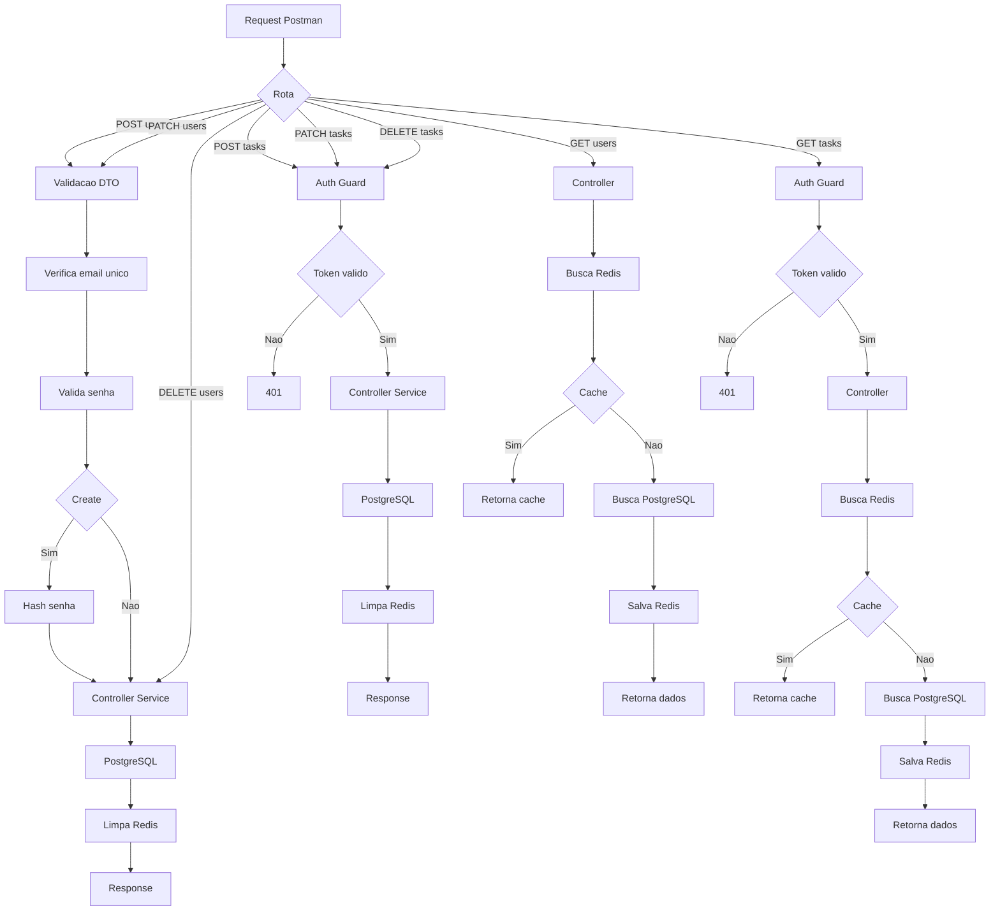

# Fluxo da API

```mermaid
flowchart TD

A[Request Postman] --> B{Rota}

B -->|POST users| U1[Validacao DTO]
B -->|PATCH users| U1
B -->|DELETE users| U6[Controller Service]

U1 --> U2[Verifica email unico]
U2 --> U3[Valida senha]
U3 --> U4{Create}

U4 -->|Sim| U5[Hash senha]
U4 -->|Nao| U6

U5 --> U6
U6 --> U7[PostgreSQL]
U7 --> U8[Limpa Redis]
U8 --> R1[Response]

B -->|POST tasks| T1[Auth Guard]
B -->|PATCH tasks| T1
B -->|DELETE tasks| T1

T1 --> T2{Token valido}
T2 -->|Nao| E1[401]
T2 -->|Sim| T3[Controller Service]
T3 --> T4[PostgreSQL]
T4 --> T5[Limpa Redis]
T5 --> R2[Response]

B -->|GET users| G1[Controller]
G1 --> G2[Busca Redis]
G2 --> G3{Cache}
G3 -->|Sim| G4[Retorna cache]
G3 -->|Nao| G5[Busca PostgreSQL]
G5 --> G6[Salva Redis]
G6 --> G7[Retorna dados]

B -->|GET tasks| TG1[Auth Guard]
TG1 --> TG2{Token valido}
TG2 -->|Nao| E2[401]
TG2 -->|Sim| TG3[Controller]
TG3 --> TG4[Busca Redis]
TG4 --> TG5{Cache}
TG5 -->|Sim| TG6[Retorna cache]
TG5 -->|Nao| TG7[Busca PostgreSQL]
TG7 --> TG8[Salva Redis]
TG8 --> TG9[Retorna dados]
```

