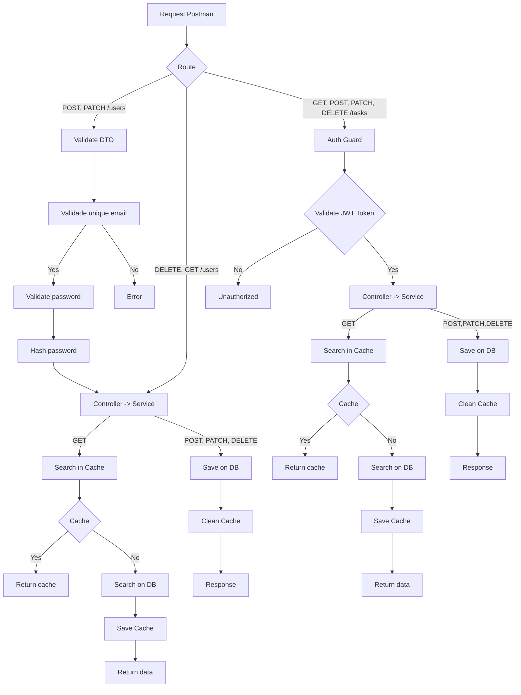

# Fluxo da API

```mermaid
flowchart TD

A[Request Postman] --> B{Route}

B -->|POST, PATCH /users| U1[Validate DTO]
B -->|DELETE, GET /users| U6[Controller -> Service]

U1 --> U2[Validade unique email]
U2 --> |Yes| U3[Validate password]
U2 --> |No| Error
U3 --> U4[Hash password]
U4 --> U6
U6 --> |GET| G2[Search in Cache]
U6 --> |POST, PATCH, DELETE| U7[Save on DB]
U7 --> U8[Clean Cache]
U8 --> R1[Response]

B -->|GET, POST, PATCH, DELETE /tasks| T1[Auth Guard]

T1 --> T2{Validate JWT Token}
T2 -->|No| E1[Unauthorized]
T2 -->|Yes| T3[Controller -> Service]
T3 --> |GET| TG4[Search in Cache]
T3 --> |POST,PATCH,DELETE|T4[Save on DB]
T4 --> T5[Clean Cache]
T5 --> R2[Response]


G2 --> G3{Cache}
G3 -->|Yes| G4[Return cache]
G3 -->|No| G5[Search on DB]
G5 --> G6[Save Cache]
G6 --> G7[Return data]


TG4 --> TG5{Cache}
TG5 -->|Yes| TG6[Return cache]
TG5 -->|No| TG7[Search on DB]
TG7 --> TG8[Save Cache]
TG8 --> TG9[Return data]
```

