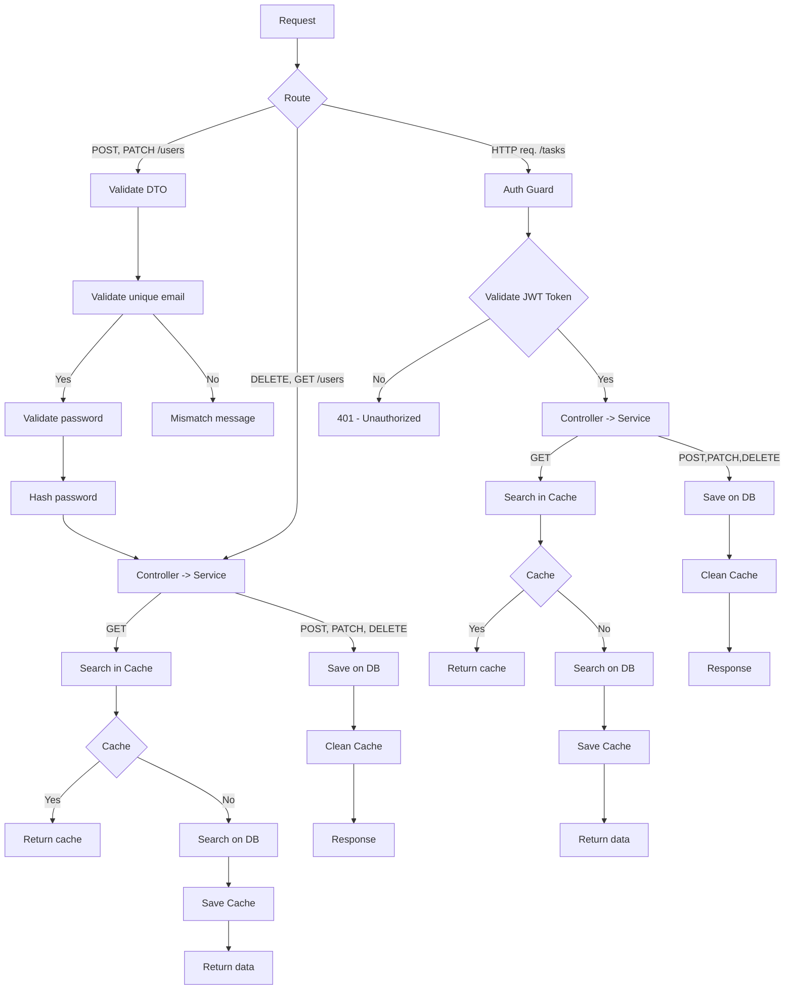

#  To-Do List API


## 📌 About the Project
This project was built to put into practice my recent studies in API development.

It demonstrates a complete backend setup with modern tools and best practices, including authentication, caching, and containerization.

## ✨ Features
-  Containerization with Docker  
-  Database integration using TypeORM  
-  Authentication with JWT tokens  
-  Password hashing using bcrypt  
-  Data caching with Redis  
-  Logging interceptor using NestJS native logger  
-  Email validation using custom decorators  
-  Data filtering via query parameters  

## 🛠️ Technologies Used
- [NestJS](https://docs.nestjs.com/)
- [PostgreSQL](https://www.postgresql.org/docs/current/)
- [Docker](https://www.docker.com/)
- [Redis](https://redis.io/)
- [TypeORM](https://docs.nestjs.com/techniques/database#typeorm-integration)
- [bcrypt](https://www.npmjs.com/package/bcrypt)

## 📋 Requirements
- Docker (version 29.2.1 or higher)

## ▶️ Starting de project 

### 1. Clone the repository
```bash
git clone https://github.com/vegetats/To-Do-List.git
```
### 2. Navigate to the project folder
```bash
cd To-Do-List
```
### 3. Run the project
```bash
docker compose up
```

## 🧪 API Testing

You can test all endpoints using my [Postman collection](https://dara-m-8555036.postman.co/workspace/Dara's-Workspace~10043cbe-dfd9-4c36-80bb-facc0a8a6b35/collection/48146023-8f1e3055-e31b-4e5e-9f76-40928189acd5?action=share&creator=48146023).

## Diagrama de Fluxo da API



